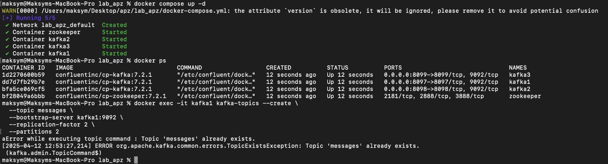
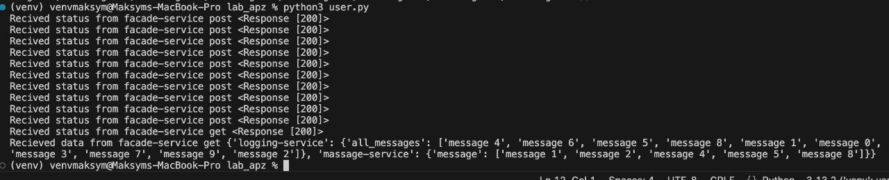
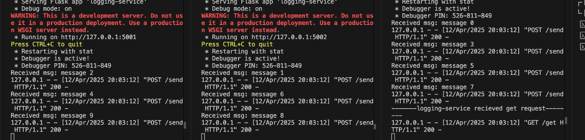
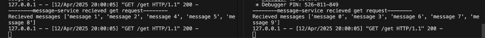
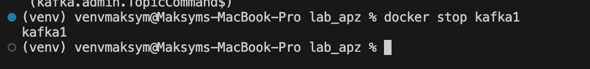
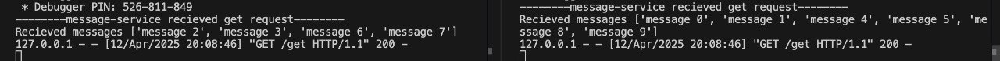

Lab Mykhailo Buleshyi

Note!!!! - для виконання цієї лабораторної я використовував ноутбук брата, через певні обставини.

Виконав завдання за допомогою kafka.

Для тестування всіх підходів створив скрипт `user.py` який робить POST та GET запити до facade-service.

Спочатку потрібно запустити kafka брокери
1) docker compose up -d
2) docker exec -it kafka1 kafka-topics --create \
  --topic messages \
  --bootstrap-server kafka1:9092 \
  --replication-factor 2 \
  --partitions 2

Як запустити сервери?
1) python -m venv venv
2) ./venv/Script/activate
3) pip install -r requirements.txt
4) python facade-service.py
5) python logging-service.py -- port 5001
6) python logging-service.py -- port 5002
7) python logging-service.py -- port 5003
8) python message-service.py -- port 5004 --partition 1
8) python message-service.py -- port 5005 --partition 1
9) python config-server.py
10) python user.py

Якщо обрано інші порти для logging-service тоді доведеться змінити ip-config.json

### Тестування.

Спершу налаштував брокери kafka

Я надіслав 10 повідомлень та отримав з facade service такий output. 
з logging service отримав усі 10 повідомлень з message service отримав лише ті які зберігаються на даній копії.

Логи з logging service

Логи з message service 

#### Відмовостійкість

Далі я тестував відмовостійкість. Спочатку з виключеними message service я надіслав 10 повідомлень далі вимкнув kafka1 брокер (Leader) .

Далі запусти message service і всеодно отримав всі десять повідомлень. 