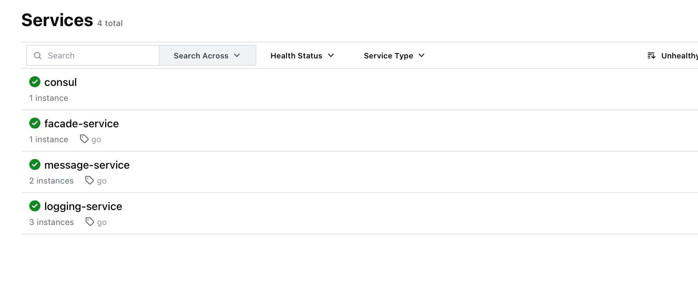
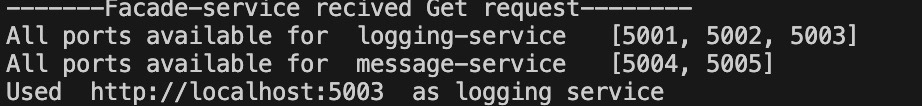
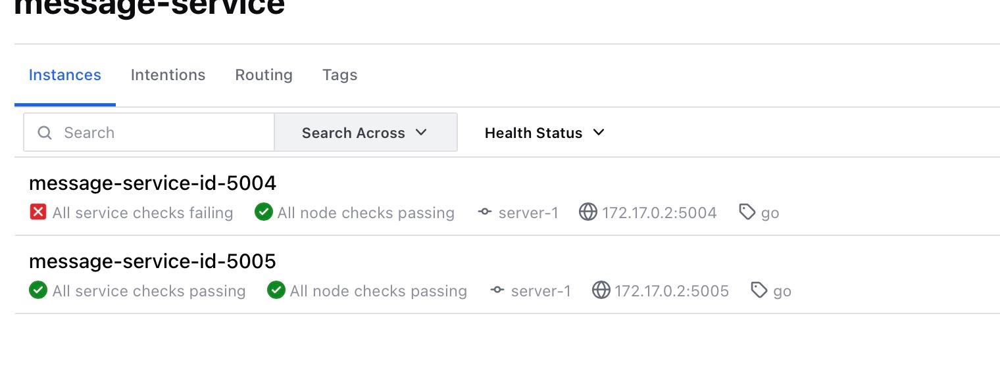
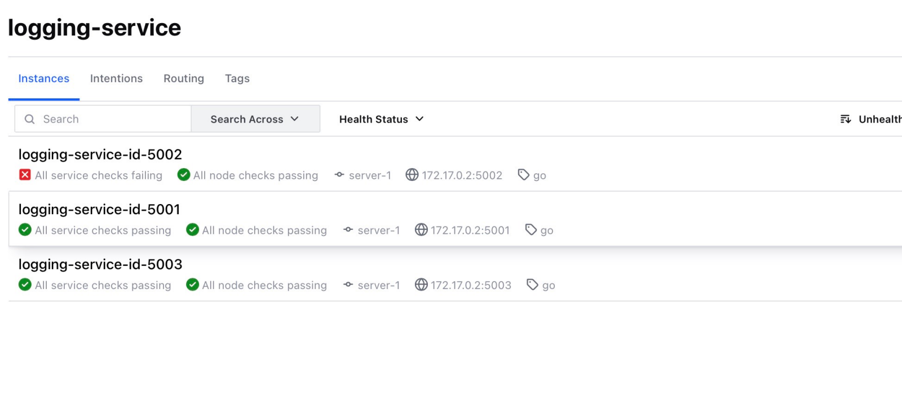
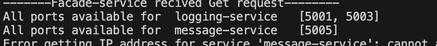

Lab Mykhailo Buleshyi

Note!!!! - для виконання цієї лабораторної я використовував ноутбук брата, через певні обставини.

Виконав завдання за допомогою kafka.

Для тестування всіх підходів створив скрипт `user.py` який робить POST та GET запити до facade-service.

Потрібно запустити Consul
source setup_consul.bash
Цей код створить контейнер для Consul.

Потрібно запустити kafka брокери
1) docker compose up -d
2) docker exec -it kafka1 kafka-topics --create \
  --topic messages \
  --bootstrap-server kafka1:9092 \
  --replication-factor 2 \
  --partitions 2
Треба додати адреси черг в Consule як key/value
3) docker exec consule consul kv put config/kafka '{"service": {"ports": [8097, 8098, 8099]}}'
Та додати вибір для Hazelcast словника (Hazelcast)
4) docker exec consule consul kv put config/hazelcast '{"service": {"map":"map_name"}}'

Також потрібно запустити як мінімум один Hazelcast node

Спочатку потрібно в facade-service.py, logging-service.py, message-service.py додати свою ip адресу
Як запустити сервери?
1) python -m venv venv
2) ./venv/Script/activate
3) pip install -r requirements.txt
4) python facade-service.py
5) python logging-service.py -- port 5001
6) python logging-service.py -- port 5002
7) python logging-service.py -- port 5003
8) python message-service.py -- port 5004 --partition 1
8) python message-service.py -- port 5005 --partition 1
10) python user.py

### Звіт.

Після виконання setup_consule.bash я отримав контейнер з consule

Далі додав сервіси, також налаштував check (щоб перевіряти чи вони активні). Для початку всі сервіси активні

При виконанні коду все працює добре і кожен сервіс знає про робочі інші.

Далі я виключив декілька сервісів оновлену інформацію check я побачив в Consul

При повторній спробі запустити тест коду я отримав лише активні адреси

